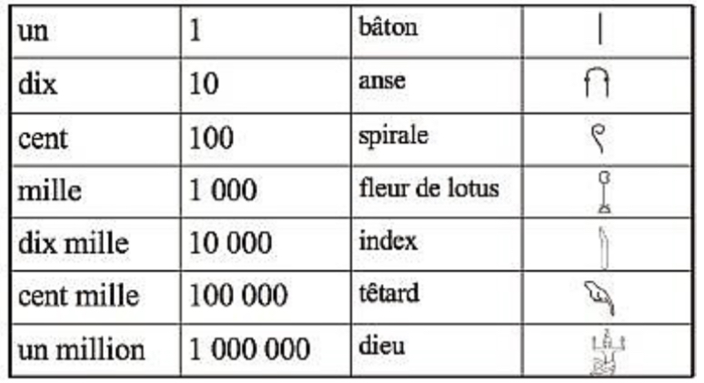

# Système de Numération

On appelle numération tout système organisé d'écriture ou d'énonciation des nombres.

Il existe 3 systèmes de numération :
- La numération par addition
- La numération hybride 
- La numération de position.

## La numération par addition

Exemple : le système egyptien. Dans cette numération, chaque symbole renvoie à une quantité toujours identique et ceci indépedamment de la position qu'il occupe dans l'écriture du nombre.
Le nombre cordé est obtenu par addition de toutes les quantités représentées par les différents chiffres 

# Exercice 

Donnez la représentation de 1527 en numération égyptienne. 

## La numération hybride
Par exemple : le système de numération romain. 

- Le nombre s'obtient par addition des quantités représentées. 
- Certaines de ces quantités peuvent être des quantités négatives, selon leur position, il faut ajouter ou retrancher les quantités représentées par différents symboles. 

