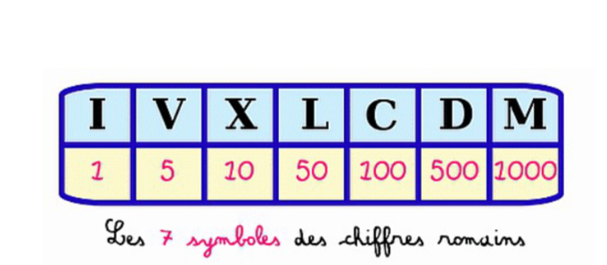
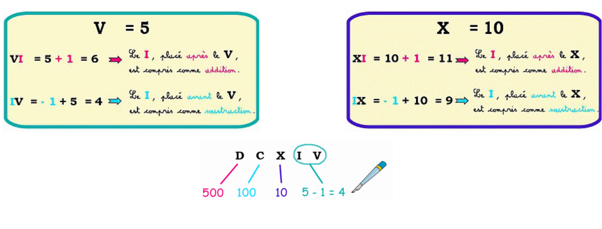
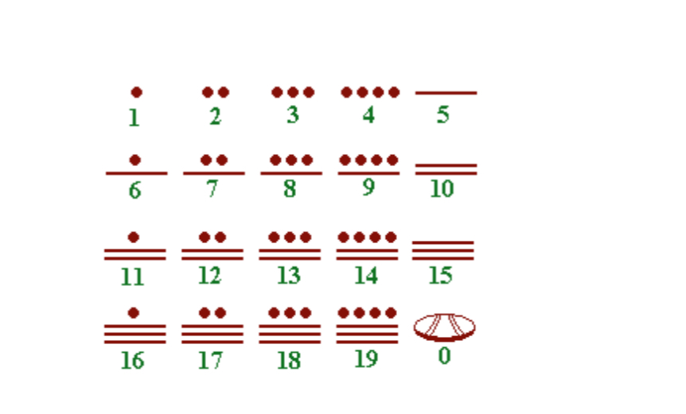
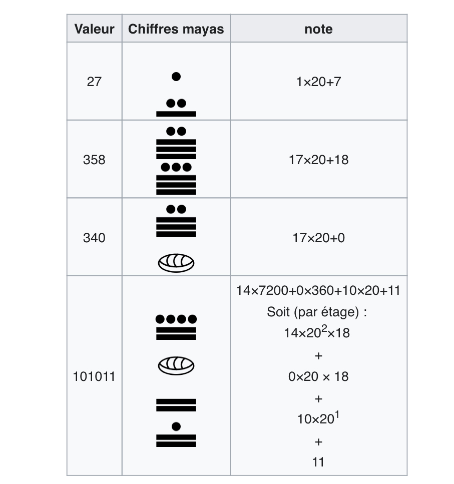

# Système de Numération

On appelle numération tout système organisé d'écriture ou d'énonciation des nombres.

Il existe 3 systèmes de numération :

- La numération par addition
- La numération hybride 
- La numération de position.

## La numération par addition

Exemple : le système egyptien. Dans cette numération, chaque symbole renvoie à une quantité toujours identique et ceci indépedamment de la position qu'il occupe dans l'écriture du nombre.
Le nombre codé est obtenu par addition de toutes les quantités représentées par les différents chiffres 

### Exercice 

Donnez la représentation de 1527 en numération égyptienne. 

## La numération hybride
Par exemple : le système de numération romain. 

- Le nombre s'obtient par addition des quantités représentées. 
- Certaines de ces quantités peuvent être des quantités négatives, selon leur position, il faut ajouter ou retrancher les quantités représentées par différents symboles. 

{target="\blank"}

### Exercice

Donnez le nombre 1497 en numération romaine.

# Numération de position 

C'est un système d'écriture qui utilise le zéro en règle générale et un nombre limité de chiffre. Dans ce système, la quantité représentée par chaque chiffre est en fonction de la place qu'il occupe dans le nombre. 
Par exemple, dans le système décimal, le nombre 257 est différent de 527 du fait de la position des chiffres. 

## Numération de position de bas en haut. 

Par exemple : le système maya. 

- La coquille vide représente le zéro. 
- chaque symbole en 2ème position est multiplié par 20
- chaque symbole en 3ème position est multiplié par $20\times 20$

## Numération base 10

- On utilise 10 symboles 0,1,2,3,4,5,6,7,8,9 qui ne représente pas la même valeur suivant la postition dans le nombre. 
- Le nombre $$abcd$$ est écrit par groupement de  : $a\times 10^3 +b\times 10^2 +c\times 10^1 +d\times 10^0$

## Numération en base 2

- Deux symboles suffisent pour écrire tous les nombres : le 0 et le 1
- le nombre $\overline{abcd}$ se décompose de la manière suivante : $a\times 2^3+b\times 2^2+c\times 2^1+d\times 2^0$

## Autres numérations

[numeration shadoks](https://youtu.be/lP9PaDs2xgQ "video shadoks")
